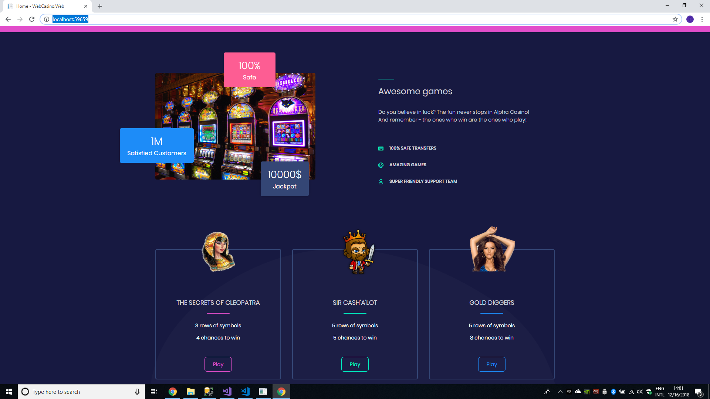
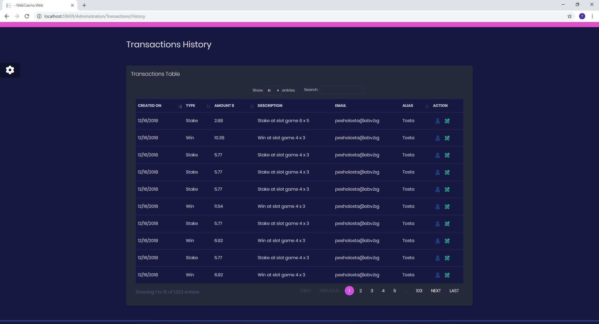
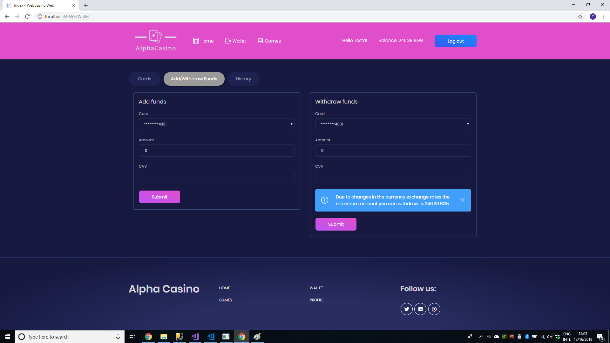

# Alpha Casino
 
Final project for the Telerik Alpha Academy

# Topic
The topic of the project is an online casino. The casino consists of several different modules. The administration module is used for controlling the users and browsing statistics for transactions. The user module is responsible for handling user transactions, adding bank cards, adding funds and withdrawing wins.

# Technologies
- ASP.NET Core 2.1 : The core of the application. ASP.NET Core 2.1 is used to create the web application and to provide usable and pleasant interface for the user while also providing stable service with proper server-side validations.
- Entity Framework Core 2.1 : The data layer of the application is built using Entity Framework Core 2.1. The technology provides safe and stable usage of the data sets while also easing the developer in the process of retrieving, creating and modifying data.
- HTML, CSS, JavaScript, jQuery : Used for the purpose of creating a beatiful, responsive and easy-to-use design for the users of the application.

# Front - end 
- DataTables : Used for creating both server-side and client-side pagination, filtration and ordering of the tables in the front end of the application.
- charts.js : Used for the purpose of displaying data in the admin dashboard in an easily presentable and attractive way.
- ezSlots.js : Used for the animations of the slot games.
- Visualisation Template by Creative Tim : A set of js and css files used to improve user experience.

# Pages and Functionality
- User Pages

Page  | Function
------------- | -------------
Wallet  | Page for any transaction and card related functionalities. Content distributed in 3 tabs for easier access
Game  | Pages for the 3 different games - small, medium and big

- Administrator Pages

Page  | Function
------------- | -------------
Dashboard | Page for displaying graphs showing the performance of the casino with wins, stakes and transactions by months and for the current day
AdminSettings  | Page for editing your admin profile
UserAdministration  | Pages for managing users - admin can change user alias if inappropriate, browse user activity and transactions, lock users and promote users to admin
Transactions | Pages for browsing all the transactions. Provides server side filtering, pagination and search functionalities. Admin can also open and inspect certain transactions.

# Games
Game  | Name | Details
------------- | ------------- | -------------
Small | The Misteries of Cleopatra | 4x3 grid
Medium | Sir Cash'a'Lot | 5x5 grid
Big | Gold Diggers | 8x5 grid

- All the games work with a set of 4 symbols. The low symbol adds 0.4 to the coefficient and has 45% occurency rate. The medium symbol adds 0.6 to the coefficient and has 35% occurency rate.
The high symbol adds 0.8 to the coefficient and has 15% occurency rate. Finally, the wild symbol adds 0 to the coefficient, has 5% occurency rate but can be used to substitute any other symbol.

- In order to win, a player should roll a row of identical symbols. The wild symbol counts as any other symbol in the game.

# Screenshots

# Design Patterns and Architecture

The whole applications is designed in a way that it follows the Inversion of Control philosophy. ASP.NET Core is responsible for the flow of the application, so the control is inverted to it. Dependancy Inversion is achieved by using the Dependancy Injection Container provided by the ASP.NET Core. In that way, the creation of dependancies is a task that the application is not battling itself - the control of the creation and lifetime of objects comes from the outside. Adapter pattern is used in several places in order to make the program testable and to provide an easy way to switch out components in case such a change is needed later in time. Service pattern is used in the bussiness layer in order to make the data layer detached from the presentation layer. By using the service pattern the presentation layer can be easily changed, because the bussiness logic is abstracted into the services and they can be used with any other form of presentational layer.